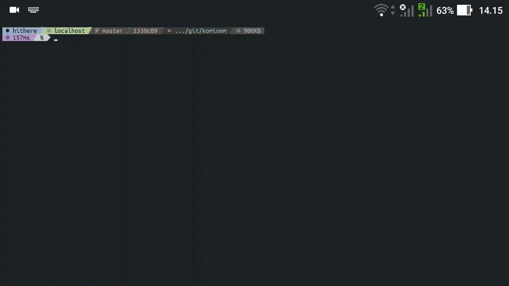

<p align="center">
<h1>komionm</h1>
This is a Python script to download said `Komi Can't Communicate` chapters. This code is messy, idk why i use `asyncio` and `aiohttp`. This script scrape [w3.komisanwamanga.com](https://w3.komisanwamanga.com) for the chapters
</p>

<h2 align="center">Showcase</h2>
<p align="center"></p>

## Windows version ?
I dont have PC. Sorry ._.

## Requirements
1. [Python](https://www.python.org)
2. sed
3. curl
4. [git](https://git-scm.com)

## How To Install
```sh
git clone https://github.com/hithere-xd/komionm.git && chmod +x komionm/komionm
sh komionm/install.sh
```

## Python Dependencies
1. asyncio
2. beautifulsoup4
3. aiohttp

## Just some stuff
1. This script works for `Termux` legacy version (`<= 0.83`) or later.
2. `GNU/Linux` version of install is untested, but i think it works just by looking at the command.
3. This script is tested on Python 3.8, but i think Python 3.6 or above should work

## Credits
1. [w3.komisanwamanga.com](https://w3.komisanwamanga.com) for the `Komi Can't Communicate` chapters and easy to scrape website.
2. StackOverflow that helps me making this script.
3. [ani-cli](https://github.com/pystardust/ani-cli) for UI inspiration.
